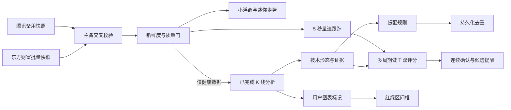

# 架构与安全门

## 产品边界

StockWatchdog 是个人本地观察与复盘工具。它不接入券商账户、不自动下单、不推断成交，
也不把做 T 买卖条件分或规则匹配强度解释成成功概率。图表上的买卖点完全由用户主动标记。

## 分层

- `StockWatchdog.Domain`：行情、K 线、形态、提醒、图表标记和主题模型。
- `StockWatchdog.Application`：分钟聚合、指标、形态、提醒去重、图表区间计算和监控编排。
- `StockWatchdog.Infrastructure`：东方财富/腾讯行情适配器、主备熔断和 SQLite。
- `StockWatchdog.App`：WPF 浮窗、技术详情、托盘、老板键、主题和设置。
- `StockWatchdog.Tests`：未来数据、午休边界、质量门、提醒、SQLite 与图表标记回归。

## 数据流

## 强制安全门

- 快照超过 `max(刷新周期 × 2, 10 秒)` 会被标记为过期。
- 主备源相对价差超过 0.5% 时标记为冲突；备用源无法校验时不产生技术提醒。
- 形态只读取 `IsFinal=true` 且价格完整的 K 线，不使用未来数据。
- 做 T 评分可读取最新健康快照作盘中预览，但分钟指标、形态和多周期趋势只使用已完成 K 线。
- 买入条件分和卖出条件分彼此独立；数据异常时均不可用，候选提醒需要连续确认并受冷却约束。
- 5/15/60 分钟聚合不得跨越午休，缺失或异常数据不得伪造成完整 K 线。
- 提醒事件使用稳定键写入 SQLite，重复报价、并发分析和重启恢复不重复报警。
- 老板键隐藏所有已注册窗口、关闭提醒窗并停止声音；后台监控继续，锁屏后不自动恢复。
- 图表区间框只比较用户标记价与最新已完成 K 线收盘价，不推断真实持仓、成本或成交。
- 做 T 评分不读取账户、持仓或可用份额，也不自动下单；分数只表示量价规则匹配强度。

## 可替换边界

`IMarketDataProvider`、`IAppRepository`、`ITechnicalAnalysisEngine` 和 `IAlertSink`
是主要替换边界。迁移至授权行情源时，无需修改领域模型和 WPF 表现层。

## 便携配置

设备迁移文本采用版本化的 `SWCFG1.<校验码>.<压缩载荷>` 格式。载荷包含界面设置、
自选列表、提醒规则和自定义主题；导入前会验证格式、数量、标的关联和 SHA-256 摘要。
设置、自选与规则在同一个 SQLite 事务中替换，失败时整体回滚。分钟/日线缓存、图表标记
和历史提醒不属于配置载荷，因此不会在导入时删除或覆盖。
